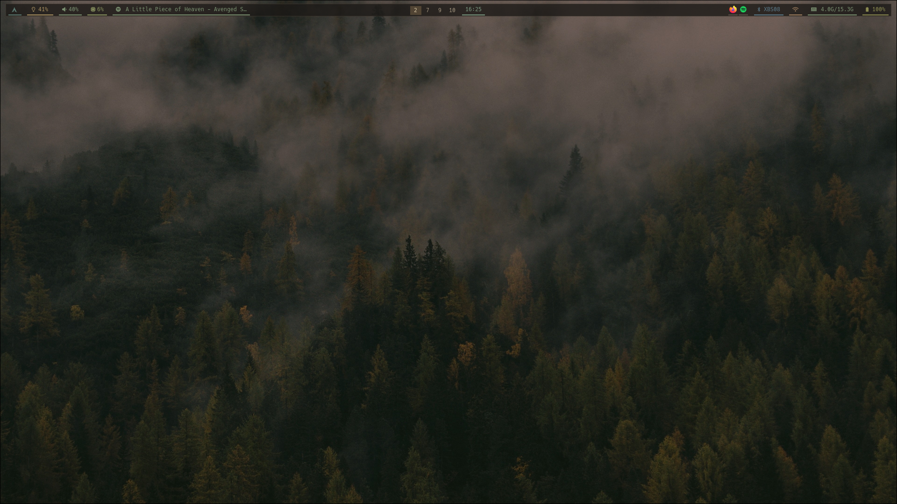

# dotfiles

## stack

| component | tool |
|---|---|
| compositor | Hyprland (Lua config) |
| bar | Waybar |
| launcher | Rofi |
| terminal | Kitty |
| shell | Zsh + Oh My Zsh + Powerlevel10k |
| editor | Neovim (LazyVim) |
| wallpaper | awww + custom pygame picker |
| lock | Hyprlock |
| idle | Hypridle |
| theme | Gruvbox Material Dark |
| icons | Gruvbox Plus Dark |

## install

See [INSTALL.md](INSTALL.md)
