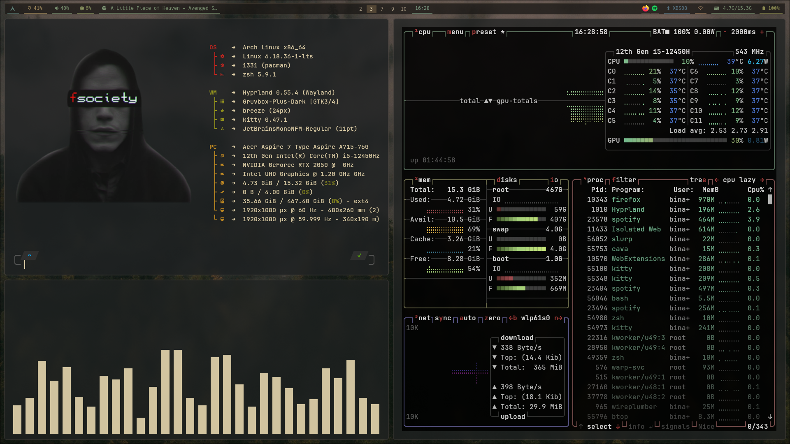
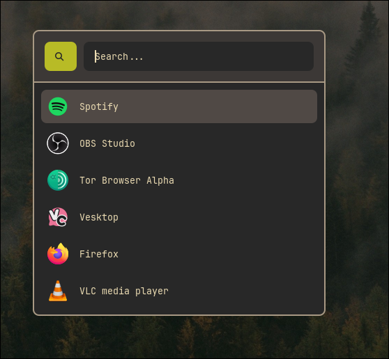
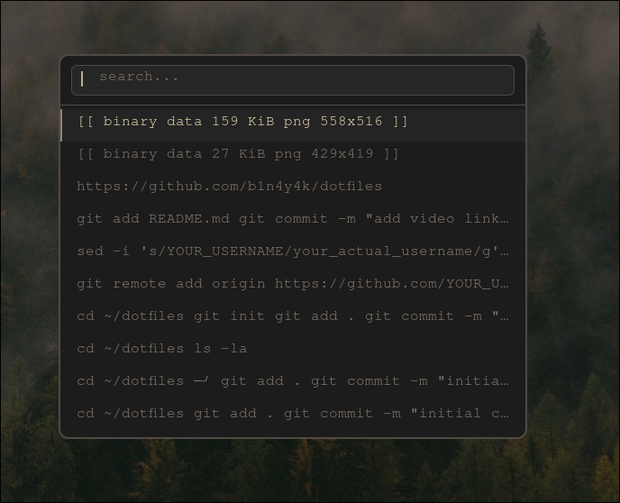
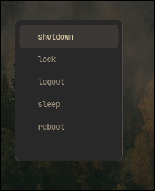

<div align="center">

# 󰪥 dotfiles

**Hyprland · Gruvbox Material Dark · Lua config**

[](https://archlinux.org)
[](https://hyprland.org)
[](https://github.com/sainnhe/gruvbox-material)
[](LICENSE)

</div>

---

## 📸 Screenshots

| | |
|:---:|:---:|
|  |  |
| *Desktop* | *Overview (Hyprland workspace view)* |
|  |  |
| *Rofi App Launcher* | *Cliphist Clipboard Manager* |
|  | |
| *Power Menu* | |


---

## 🗂 Stack

| Component | Tool |
|:---|:---|
| 🖥 Compositor | [Hyprland](https://hyprland.org) *(Lua config)* |
| 📊 Bar | [Waybar](https://github.com/Alexays/Waybar) |
| 🚀 Launcher | [Rofi](https://github.com/davatorium/rofi) |
| 💻 Terminal | [Kitty](https://sw.kovidgoyal.net/kitty/) |
| 🐚 Shell | Zsh + [Oh My Zsh](https://ohmyz.sh) + [Powerlevel10k](https://github.com/romkatv/powerlevel10k) |
| 📝 Editor | [Neovim](https://neovim.io) *(LazyVim)* |
| 🖼 Wallpaper | [awww](https://github.com/hyprwm/hyprpaper) + custom pygame picker |
| 🔒 Lock | [Hyprlock](https://github.com/hyprwm/hyprlock) |
| 😴 Idle | [Hypridle](https://github.com/hyprwm/hypridle) |
| 🎨 Theme | [Gruvbox Material Dark](https://github.com/sainnhe/gruvbox-material) |
| 🔣 Icons | Gruvbox Plus Dark |
| 📋 Clipboard | cliphist + wl-paste |
| 🔍 System Info | [Fastfetch](https://github.com/fastfetch-cli/fastfetch) |

---

## ⌨️ Key Bindings

| Shortcut | Action |
|:---|:---|
| `Super + Return` | Launch Kitty terminal |
| `Super + B` | Launch Firefox |
| `Super + C` | Launch VS Code |
| `Super + E` | Launch Thunar file manager |
| `Super + A` | Rofi app launcher |
| `Super + Space` | Rofi window switcher |
| `Super + Shift + Space` | Rofi search |
| `Super + V` | Clipboard history (cliphist) |
| `Super + W` | Wallpaper picker |
| `Super + L` | Lock screen (Hyprlock) |
| `Super + Shift + L` | Power menu |
| `Super + Q` | Close window |
| `Super + F` | Toggle fullscreen |
| `Super + K` | Toggle floating |
| `Super + ←/→/↑/↓` | Focus window |
| `Super + Z / X` | Drag / Resize window |

---

## 📁 Structure

```
dotfiles/
├── hypr/               # Hyprland compositor (Lua)
│   ├── themes/         # Colors, gaps, borders, rounding
│   ├── animations.lua  # Custom bezier curves & animation tree
│   ├── keybindings.lua # All keymaps
│   ├── windowrules.lua # Per-app window rules
│   ├── hyprlock.conf   # Lock screen config
│   ├── hypridle.conf   # Idle daemon config
│   └── scripts/
│       └── wallpaper.py  # pygame wallpaper picker
├── waybar/             # Status bar
│   ├── config.jsonc
│   └── style.css
├── rofi/               # Launcher, menus & search
│   ├── launcher/
│   ├── powermenu/
│   ├── window/
│   ├── search/
│   └── iwmenu/         # Wi-Fi picker
├── kitty/              # Terminal (Gruvbox dark theme)
├── nvim/               # Neovim (LazyVim)
├── fastfetch/          # System info with custom robot logo
├── gtk-3.0/            # GTK 3 theme settings
├── gtk-4.0/            # GTK 4 theme settings
├── wofi/               # Alternate power menu (wofi)
├── wallpapers/         # Wallpaper collection
└── .zshrc              # Zsh config (OMZ + Powerlevel10k)
```

---

## 🚀 Install

> **Note:** Not tested. Use on your own risk 
> **Prerequisites:** Arch Linux (or Arch-based), `paru` or `yay` AUR helper


### 1 — Clone the repo

```bash
git clone https://github.com/b1n4y4k/dotfiles.git ~/dotfiles
cd ~/dotfiles
```

### 2 — Install dependencies

```bash
# Compositor & display
paru -S hyprland hyprlock hypridle hyprpaper xdg-desktop-portal-hyprland

# Bar & launcher
paru -S waybar rofi-wayland

# Terminal & shell
paru -S kitty zsh oh-my-zsh-git zsh-theme-powerlevel10k

# Editor
paru -S neovim

# Utilities
paru -S fastfetch wofi cliphist wl-clipboard pavucontrol thunar brightnessctl wireplumber

# Fonts & icons
paru -S ttf-iosevka ttf-nerd-fonts-symbols gruvbox-plus-icon-theme-git
```

### 3 — Stow (or symlink) configs

```bash
# Using GNU stow (recommended)
paru -S stow
stow --dir=~/dotfiles --target=~/.config hypr waybar rofi kitty nvim fastfetch gtk-3.0 gtk-4.0 wofi

# Or manually copy
cp -r ~/dotfiles/hypr     ~/.config/
cp -r ~/dotfiles/waybar   ~/.config/
cp -r ~/dotfiles/rofi     ~/.config/
cp -r ~/dotfiles/kitty    ~/.config/
cp -r ~/dotfiles/nvim     ~/.config/
cp -r ~/dotfiles/fastfetch ~/.config/
```

### 4 — Set up Zsh

```bash
cp ~/dotfiles/.zshrc ~/
cp ~/dotfiles/.p10k.zsh ~/
chsh -s $(which zsh)
```

### 5 — Launch

Log out and select **Hyprland** from your display manager, or start it directly:

```bash
Hyprland
```

---

## 🎨 Color Palette (Gruvbox Material Dark)

| Role | Hex | Preview |
|:---|:---|:---|
| Background | `#282828` |  |
| Background 1 | `#3c3836` |  |
| Foreground | `#ebdbb2` |  |
| Red | `#cc241d` |  |
| Green | `#98971a` |  |
| Yellow | `#d79921` |  |
| Blue | `#458588` |  |
| Purple | `#b16286` |  |
| Aqua | `#689d6a` |  |
| Orange | `#d65d0e` |  |

---

<div align="center">

Made with 󰣇 on Arch · **[b1n4y4k](https://github.com/b1n4y4k)**

</div>
